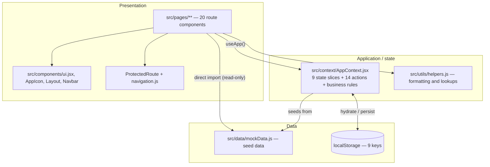
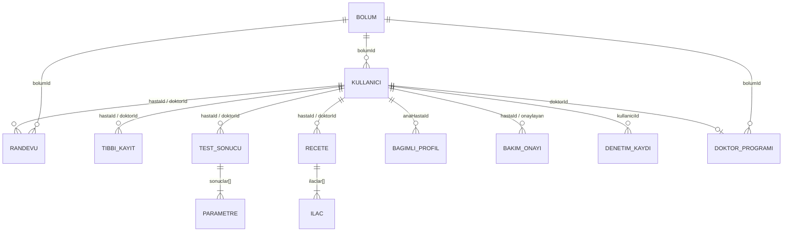
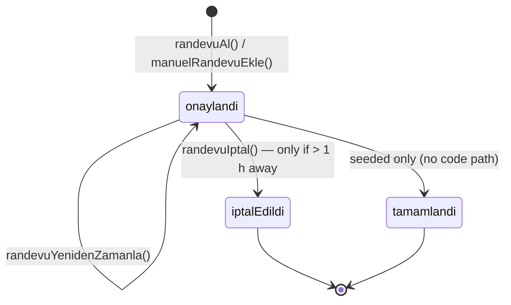

# Architecture

Technical reference for the MediCare prototype. Everything here was verified against the source in this repository.

- [Layers](#layers)
- [Data model](#data-model)
- [AppContext API](#appcontext-api)
- [Persistence and session](#persistence-and-session)
- [Access control](#access-control)
- [State machines](#state-machines)
- [Routing](#routing)
- [UI system](#ui-system)
- [Helpers](#helpers)
- [Adding a real backend](#adding-a-real-backend)

---

## Layers

The prototype has three layers and no network boundary. `mockData.js` plays the role of the database, `AppContext` plays the role of the application/service layer, and the pages are the presentation layer.



### The mutable / read-only split

This is the single most important structural fact about the app.

| Kind | Entities | Path into the UI | Survives a reload? | Can be changed at runtime? |
| --- | --- | --- | --- | --- |
| **Mutable** | `randevular`, `receteler`, `bagimliProfiller`, `bakimOnayi`, `denetimKayitlari`, `doktorProgramlari`, `personelListesi`, `aktifKullanici`, `aktifProfil` | `useApp()` → context → `localStorage` | Yes | Yes |
| **Read-only** | `testSonuclari`, `tibbiKayitlar`, `bolumler`, `sssIcerigi` | `import { … } from '../data/mockData'` | N/A — always re-read from source | No |

Pages that import read-only data directly: `doktor/DoktorDashboard.jsx`, `doktor/HastaKayitlari.jsx`, `hasta/HastaDashboard.jsx`, `hasta/RandevuAl.jsx`, `hasta/TestSonuclari.jsx`, `hemsire/HemsireHastaKayitlari.jsx`, `onBuro/ManuelRandevu.jsx`, `onBuro/TestDurumu.jsx`, `SSS.jsx`.

Consequence: a test can never move from `bekliyor` to `hazır` in the running app, and departments cannot be added. Making those mutable means lifting them into `AppContext` the same way the other nine were.

---

## Data model



### ID prefixes

| Prefix | Entity | Seeded range | Runtime ids |
| --- | --- | --- | --- |
| `H` | Patient | `H001`–`H003` | `H` + `Date.now()` |
| `D` | Doctor | `D001`–`D004` | — |
| `HEM` | Nurse | `HEM001`–`HEM002` | — |
| `OB` | Front desk | `OB001`–`OB002` | — |
| `B` | Department | `B001`–`B008` | — |
| `DP` | Doctor schedule | `DP001`–`DP004` | — |
| `R` | Appointment | `R001`–`R006` | `R` + `Date.now()` |
| `TK` | Medical record | `TK001`–`TK004` | — |
| `TS` | Test result | `TS001`–`TS005` | — |
| `RC` | Prescription | `RC001`–`RC004` | — |
| `BP` | Dependent profile | `BP001`–`BP002` | `BP` + `Date.now()` |
| `BVO` | Caregiver consent | `BVO001` | `BVO` + `Date.now()` |
| `SSS` | FAQ entry | `SSS001`–`SSS012` | — |
| `DK` | Audit entry | `DK001`–`DK003` | `DK` + `Date.now()` |

### Entity fields

**`kullanicilar` — user (all four roles in one array)**

| Field | Type | Notes |
| --- | --- | --- |
| `id` | string | Prefixed by role |
| `tc` | string | 11-digit national identity number; the login key |
| `sifre` | string | Present in the seed data, **never checked by the sign-in flow** |
| `rol` | `'hasta' \| 'doktor' \| 'hemsire' \| 'onBuro'` | Drives menus and route guards |
| `ad`, `soyad` | string | Given name, family name |
| `dogumTarihi` | `YYYY-MM-DD` | Date of birth |
| `telefon`, `email` | string | `telefon` is also the account-recovery key |
| `cinsiyet`, `kan` | string | Patients only — gender, blood type |
| `uzmanlik`, `bolumId` | string | Doctors and nurses only — specialty and department |

**`bolumler` — department:** `id`, `ad` (name), `ikon` (emoji).

**`doktorProgramlari` — doctor schedule:** `id`, `doktorId`, `bolumId`, `musait` (boolean — accepting patients), `musaitSaatler` (array of `{ tarih: 'YYYY-MM-DD', saatler: ['09:00', …] }`).

**`randevular` — appointment:** `id`, `hastaId`, `doktorId`, `bolumId`, `tarih`, `saat`, `durum`, `notlar`. Front-desk entries also carry `manuelGiris: true` and `girenPersonel`; transferred appointments carry `devirNotu`.

**`tibbiKayitlar` — medical record:** `id`, `hastaId`, `doktorId`, `tarih`, `tani` (diagnosis), `notlar`, `semptomlar` (symptoms).

**`testSonuclari` — test result:** `id`, `hastaId`, `doktorId`, `tarih`, `testAdi`, `durum` (`'hazır'` or `'bekliyor'`), `notlar`, and `sonuclar[]` of `{ parametre, deger, referans, normal }`.

**`receteler` — prescription:** `id`, `hastaId`, `doktorId`, `tarih`, `gecerlilikBitis` (valid until), `tani`, `aktif`, and `ilaclar[]` of `{ ilacAdi, doz, kullanimSikligi, sure, talimatlar }`. `receteGuncelle()` adds `guncellemeTarihi`.

**`bagimliProfiller` — dependent profile:** `id`, `anaHastaId` (account holder), `ad`, `soyad`, `dogumTarihi`, `yakinlikTuru` (relationship), `tc`, `telefon`, `aktif`.

**`bakimVerenOnayi` — caregiver consent:** `id`, `hastaId`, `bakimVerenAd`, `bakimVerenTc`, `yakinlikTuru`, `onayTarihi`, `onaylayan` (approving staff id), `aktif`.

**`sssIcerigi` — FAQ entry:** `id`, `kategori`, `soru`, `cevap`. Categories: Appointments, Test Results, Prescriptions, Account, Security, Technical.

**`denetimKayitlari` — audit entry:** `id`, `kullaniciId`, `zaman` (ISO timestamp), `islem` (action), `detay` (description). Newest entries are prepended.

---

## AppContext API

`useApp()` returns state plus the actions below. Every action returns `{ basarili: boolean }`, adding `mesaj` on failure and sometimes the created record on success. Nothing throws.

| Action | Signature | What it does | Audits |
| --- | --- | --- | --- |
| `girisYap` | `(tc, rol)` | Finds a user matching **both** national ID and role in `personelListesi`; sets `aktifKullanici`, clears `aktifProfil`. Fails with "Invalid National ID or role selection." | `Login` |
| `kayitOl` | `(bilgiler)` | Rejects a duplicate `tc`; otherwise appends `{ id: 'H'+Date.now(), rol: 'hasta', ...bilgiler }` to `personelListesi` | no |
| `oturumuKapat` | `()` | Clears `aktifKullanici` and `aktifProfil` in state **and** in `localStorage` immediately | no |
| `randevuAl` | `(veri)` | Creates an appointment with `durum: 'onaylandi'` for `aktifProfil?.id ?? aktifKullanici.id`. Returns `{ basarili, randevu }` | `Appointment booked` |
| `randevuIptal` | `(randevuId)` | **Enforces the 1-hour rule**, then sets `durum: 'iptalEdildi'`. The record is never deleted | `Appointment cancelled` |
| `randevuYenidenZamanla` | `(randevuId, yeniTarih, yeniSaat)` | Updates date and time and resets `durum` to `'onaylandi'` | `Appointment rescheduled` |
| `receteGuncelle` | `(receteId, guncelIlaclar)` | Replaces the medication array and stamps `guncellemeTarihi` with today's date | `Prescription updated` |
| `bagimliProfilEkle` | `(veri)` | Adds `{ id: 'BP'+Date.now(), anaHastaId: aktifKullanici.id, aktif: true, ...veri }`. Returns `{ basarili, profil }` | no |
| `bakimVerenOnasiEkle` | `(veri)` | Adds a consent stamped with today's date and `onaylayan: aktifKullanici.id` | `Caregiver consent recorded` |
| `manuelRandevuEkle` | `(veri)` | Like `randevuAl` but flags `manuelGiris: true` and records `girenPersonel`. Returns `{ basarili, randevu }` | `Manual appointment` |
| `doktorProgramiGuncelle` | `(doktorId, yeniProgram)` | Shallow-merges into that doctor's schedule record | `Schedule updated` |
| `doktorDevirAta` | `(mevcutDoktorId, yeniDoktorId)` | Moves **every `onaylandi` appointment** from one doctor to another and writes `devirNotu` on each | `Coverage transfer` |
| `personelRoluGuncelle` | `(personelId, yeniRol)` | Changes a user's role in `personelListesi` | `Role changed` |
| `profilGuncelle` | `(guncelBilgiler)` | Merges into the signed-in user in both `personelListesi` and `aktifKullanici` | no |
| `denetimEkle` | `(islem, detay)` | Prepends an audit entry. No-ops when nobody is signed in | — |
| `setAktifProfil` | `(profil \| null)` | Raw state setter, used for dependent-profile switching | no |

**Derived value.** `aktifHastaId = aktifProfil ? aktifProfil.id : aktifKullanici?.id`. Every patient page reads data through this, which is what makes dependent switching work without a new session.

---

## Persistence and session

### localStorage keys

Nine keys, all JSON, all written by a dedicated `useEffect` that fires whenever its slice changes:

`aktifKullanici` · `aktifProfil` · `randevular` · `receteler` · `bagimliProfiller` · `bakimOnayi` · `denetimKayitlari` · `doktorProgramlari` · `personelListesi`

Reads and writes go through a small `ls` helper that swallows every error, so a browser with storage disabled degrades to in-memory-only state rather than crashing.

### Hydration

Each `useState` uses a lazy initialiser: `useState(() => ls.get(key, seedFromMockData))`. A key that is missing or malformed falls back to the seed. This is why deleting the site's storage restores the demo data.

### Inactivity timeout

```
aktifKullanici set
  → listen for mousedown, mousemove, keydown, scroll, touchstart
  → each event: sonIslemZamani = Date.now()
  → every 30 s: if (now − sonIslemZamani > 15 min) → oturumuKapat() + alert
  → on sign-out or unmount: remove listeners, clear interval
```

The interval is re-created on every activity event because `sonIslemZamani` is in the effect's dependency list — acceptable at this scale, but worth noting if the app grows.

---

## Access control

Two pieces, both client-side:

1. **`ProtectedRoute`** — takes `roller` (an allowed-role array). No `aktifKullanici` → `<Navigate to="/giris" replace />`. Wrong role → an **Access Denied** card naming the current role. Otherwise the children render.
2. **`navigation.js`** — `roleMeta` gives each role a label, home route and accent colour; `roleMenus` gives each role its nav items. `Navbar` renders the menu for `aktifKullanici.rol` only, so a user never sees another role's links.

Both run in the browser. Anyone can edit `localStorage` and change their own role. In a real deployment the same matrix has to be enforced on the server, and the client checks become a convenience.

---

## State machines

### Appointment (`durum`)



`tamamlandi` exists in the seed data and is rendered everywhere, but no action in the prototype produces it — marking an appointment completed is not implemented.

### Test result (`durum`)

`bekliyor` → `hazır`. Seeded only; `testSonuclari` is read-only, so no transition happens at runtime.

### Prescription (`aktif`)

`true` / `false`. Seeded only; `receteGuncelle()` changes the medication list but never the flag.

### Status rendering

`src/utils/helpers.js` maps every status to a label and a colour, so badges stay consistent across pages:

| `durum` | `durumTurkce` label | `durumTonu` | `durumRenk` classes |
| --- | --- | --- | --- |
| `onaylandi` | Confirmed | `success` | emerald |
| `tamamlandi` | Completed | `info` | cyan |
| `iptalEdildi` | Cancelled | `danger` | rose |
| `bekliyor` | Pending | `warning` | amber |
| `hazır` | Ready | `success` | emerald |

---

## Routing

Declared in [`src/App.jsx`](../src/App.jsx).

| Route | Guard | Component |
| --- | --- | --- |
| `/giris` | public | `Giris` |
| `/kayit` | public | `Kayit` |
| `/hesap-kurtar` | public | `HesapKurtar` |
| `/sss` | public | `SSS` |
| `/profil` | any signed-in role | `Profil` |
| `/hasta`, `/hasta/randevu-al`, `/hasta/randevularim`, `/hasta/test-sonuclari`, `/hasta/recetelerim`, `/hasta/bagimli-profiller` | `hasta` | patient pages |
| `/doktor`, `/doktor/program`, `/doktor/hasta-kayitlari`, `/doktor/recete-yonetimi` | `doktor` | doctor pages |
| `/hemsire`, `/hemsire/program`, `/hemsire/hasta-kayitlari` | `hemsire` | nurse pages |
| `/on-buro`, `/on-buro/randevular`, `/on-buro/manuel-randevu`, `/on-buro/test-durumu`, `/on-buro/bakim-veren`, `/on-buro/personel-yonetimi`, `/on-buro/doktor-program` | `onBuro` | front-desk pages |
| `/` and `*` | — | redirect to `/giris` |

Routing is flat — no nested layout routes. Each page renders `<Layout>` itself.

---

## UI system

### Components — `src/components/ui.jsx`

| Component | Purpose |
| --- | --- |
| `Button` | Variant/size-driven button |
| `Surface`, `SectionCard` | Panel containers |
| `PageHeader` | Title, description, actions, breadcrumb area |
| `Badge` | Tone-driven pill (pairs with `durumTonu`) |
| `StatCard` | Dashboard metric tile with icon and accent |
| `EmptyState` | Icon + title + description + optional action |
| `InfoBanner` | Inline info / warning / error notice |
| `Field` | Label + hint + error wrapper for inputs |
| `Tabs` | Controlled tab bar (used for appointment filters) |
| `Modal` | Overlay dialog with title, description, close |
| `DataTable` | Column-driven table with a built-in empty state |
| `Stepper` | Step indicator for the booking wizard |

`AuthField` is a re-export of `Field` for the auth pages; `AuthShell` is the split layout those pages sit in. `ui-helpers.js` holds `cn(...)` (a conditional class joiner) and the shared `inputClassName`.

### Icons — `src/components/AppIcon.jsx`

A registry mapping short names (`dashboard`, `calendar`, `flask`, `capsule`, `records`, `group`, `users`, `swap`, …) to Heroicons components. Pages and `roleMenus` reference icons by name, so the icon library is swappable in one file.

### Styling

Tailwind CSS v4 via `@tailwindcss/vite` — no `tailwind.config.js` and no PostCSS setup; `src/index.css` simply does `@import "tailwindcss"`. Above that import it defines CSS custom properties (`--bg`, `--surface`, `--border`, `--text`, `--muted`, `--primary`, `--primary-deep`, `--accent`) plus the page gradient and the `app-panel` / `app-shell-bg` utility classes that `Layout` uses. Fonts are Figtree and Source Sans 3 from Google Fonts.

---

## Helpers

`src/utils/helpers.js`:

| Function | Purpose |
| --- | --- |
| `tarihFormat(str)` | `YYYY-MM-DD` → `MM/DD/YYYY`, `—` when empty |
| `tarihSaatFormat(iso)` | ISO → localised medium date + short time (`en-US`) |
| `kullaniciBul(id, liste?)` | User lookup; falls back to the seed list when no live list is passed |
| `kullaniciAdSoyad(id, liste?)` | Full name, or the id when not found |
| `bolumBul(id)` / `bolumAdi(id)` | Department lookup / name |
| `rolTurkce(rol)` | Role code → English label |
| `durumRenk` / `durumTonu` / `durumTurkce` | Status → Tailwind classes / `Badge` tone / English label |
| `uniqueId(prefix)` | `prefix_timestamp_random` |
| `bugunStr()` | Today as `YYYY-MM-DD` |
| `gelecekMi(tarih, saat)` | Is this slot in the future? |

Note the naming: `rolTurkce` and `durumTurkce` are historical names from an earlier Turkish-language build. They now return **English** strings.

---

## Adding a real backend

The `AppContext` action surface is already a service interface — each action is one operation with a `{ basarili, mesaj }` result. Making it a real client means turning each body into a request and keeping the same contract.

### Mapping

| Context action | Suggested endpoint |
| --- | --- |
| `girisYap` | `POST /auth/login` → `POST /auth/verify-otp` → session token |
| `kayitOl` | `POST /patients` |
| `oturumuKapat` | `POST /auth/logout` |
| `randevuAl`, `manuelRandevuEkle` | `POST /appointments` |
| `randevuIptal` | `POST /appointments/{id}/cancel` |
| `randevuYenidenZamanla` | `PATCH /appointments/{id}` |
| `receteGuncelle` | `PATCH /prescriptions/{id}` |
| `bagimliProfilEkle` | `POST /patients/{id}/dependents` |
| `bakimVerenOnasiEkle` | `POST /caregiver-consents` |
| `doktorProgramiGuncelle` | `PATCH /doctors/{id}/schedule` |
| `doktorDevirAta` | `POST /doctors/{id}/transfer-coverage` |
| `personelRoluGuncelle` | `PATCH /users/{id}/role` |
| `profilGuncelle` | `PATCH /users/me` |
| `denetimEkle` | implicit — the server writes the audit trail |

### Work required beyond the mapping

1. **Move the business rules to the server.** The 1-hour cancellation cutoff and the slot-collision check must be authoritative on the server; two clients can currently book the same slot because availability is computed locally.
2. **Server-side RBAC.** Every endpoint enforces the role matrix; `ProtectedRoute` becomes a UX affordance only.
3. **Real authentication.** Password or OTP verification against a provider, a signed session token, and a refresh strategy. Remove `sifre` from any payload the client sees.
4. **Replace `localStorage` with a cache.** Keep only the session token locally; fetch entities on demand (React Query or similar) so state is not stale across devices.
5. **Make the read-only entities mutable.** Test results, medical records, departments and FAQ move behind the same service layer.
6. **Async-aware UI.** Actions become promises, so pages need loading and error states — today every action is synchronous and always succeeds or fails instantly.
7. **Audit at the boundary.** Generate audit entries server-side so they cannot be skipped or forged.

The SDD describes the target as five layers — Presentation, Application, Data Access, Database and External Services. Steps 1–7 above are what moves this repository from a single collapsed layer to that structure; see [SDD.md](SDD.md).
