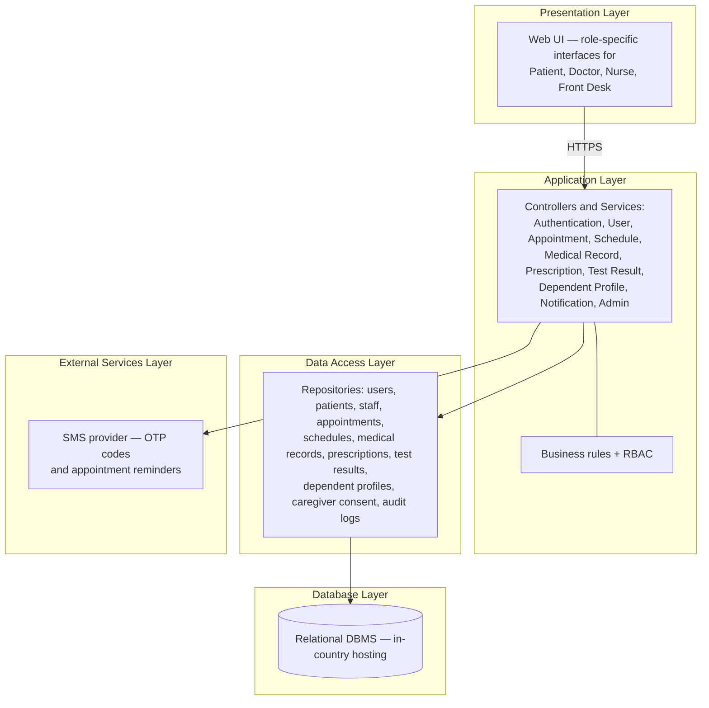

# Software Design Document

**Online Hospital Management System**
TED University — CMPE 313 / SENG 214 Software Engineering · Section 3, Team 6 · Spring 2026

> This is the technical content of the team's SDD, reproduced without the cover page, signatures or any personal data. It describes the **designed** system — a five-layer client-server application with a relational database and an external SMS provider. The prototype in this repository implements the presentation layer and the business rules, with mock data in place of the lower layers; see [ARCHITECTURE.md](ARCHITECTURE.md) for what was actually built.
>
> Revision history: v1.0 (2026-04-25, introduction started) · v1.1 (2026-04-29, introduction and system overview completed) · v1.2 (2026-05-02, screenshots edited) · v1.3 (2026-05-05, final sections completed).

---

## 1. Introduction

### 1.1 Purpose

This SDD explains the architecture, system design, main components, data organisation and technical structure of the Online Hospital Management System, and describes how the design satisfies the functional and non-functional requirements defined in the [SRS](SRS.md).

The system supports appointment management, secure authentication, medical record access, prescription tracking, test result viewing, dependent profile management, staff schedule management and notification services. The intended audience is developers, designers, testers, maintainers, supervisors and instructors.

### 1.2 Scope

Four user groups: patients, doctors, nurses and front desk staff. Patients book, cancel and reschedule appointments, view test results and prescriptions, and manage dependent profiles. Doctors view schedules, access authorized medical records and update prescriptions. Nurses access role-relevant patient information. Front desk staff enter appointments manually, manage schedules, register caregiver consent and view limited test status.

Main functionality in scope:

1. Patient registration and secure login using ID information and SMS verification
2. Role-based access control for all four roles
3. Online appointment booking through department, doctor and time-slot selection
4. Appointment cancellation and rescheduling with time restrictions
5. Schedule viewing and management according to role and permissions
6. Medical record access by authorized healthcare staff
7. Test result and prescription viewing, download and print
8. Dependent profile management and in-session profile switching
9. Caregiver consent registration
10. SMS notifications and an FAQ section
11. Audit logging of sensitive operations

---

## 2. System overview

A web-based system that centralizes hospital operations. Patients select a department, choose a doctor, view available slots and create an appointment without calling the hospital. Staff manage daily workflows according to role.

Authentication is two-step: ID information followed by an SMS code. After authentication, role-based access control limits each user to the functions and data permitted for their role.

The architecture is **modular and layered**: presentation, application, data access, database and external services. Users interact through a web browser.

**System modules:** Authentication and Authorization · User and Role Management · Appointment Management · Schedule Management · Medical Records · Test Results · Prescription Management · Dependent Profile Management · Caregiver Consent · Notification · FAQ · Audit and Logging · Staff and Administrative Management.

Persistent data lives in a relational database: user accounts, patient profiles, staff information, departments, doctor schedules, appointments, medical records, prescriptions, test results, dependent relationships, caregiver consent records, notifications, FAQ records and audit logs.

An external SMS service handles login verification and appointment reminders. All communication runs over HTTPS/TLS. The system is expected to support roughly 400–500 daily patients and remain available 24/7.

---

## 3. System architecture

### 3.1 Architectural design

A **layered client–server architecture with modular design**. Requests travel from the browser to the backend server, which applies business rules, checks permissions, talks to the database and returns responses.



**Presentation layer.** All user interaction. Each role sees a different interface with role-appropriate functions and data. This layer never touches the database directly — it issues requests over HTTPS and renders the responses.

**Application layer.** The main business logic: validating inputs, managing login and SMS verification, enforcing RBAC, applying booking rules, checking cancellation and rescheduling restrictions, managing patient and staff workflows, protecting sensitive medical data and coordinating between services.

**Data access layer.** Mediates between the application layer and the database, hiding storage details behind repositories. Particularly important for appointment management, where multiple users may attempt to reserve the same slot concurrently — the layer must preserve appointment and schedule consistency under concurrent access.

**Database layer.** All persistent data. A relational DBMS was chosen because the data is highly structured and interrelated (patients, doctors, appointments, prescriptions, test results, schedules, roles, consent records). It must support data integrity, referential integrity, secure storage and concurrent access, and must be hosted within the country.

**External services layer.** Systems outside the core, chiefly the SMS provider used for one-time login codes and appointment reminders. Keeping it separate means the provider can be swapped without redesigning the system.

### 3.2 Decomposition description

| Module | Responsibility |
| --- | --- |
| **Authentication and Authorization** | Login, logout, SMS verification, session creation, session timeout, access control. Validates ID information, sends and verifies codes, enforces RBAC, blocks unauthorized access |
| **User and Role Management** | Stores and manages patients, doctors, nurses and front desk staff; supports role-based rules; blocks unauthorized users from restricted operations |
| **Appointment Management** | Booking, cancellation, rescheduling and manual entry. Validates department, doctor and slot selection; prevents double booking; keeps appointment data consistent |
| **Schedule Management** | Doctor schedules and availability. Displays schedules by role, stores and updates availability, shows free slots, supports coverage reassignment, preserves consistency between schedules and appointments |
| **Medical Records** | Record access for authorized staff, permission checks before display, blocks unauthorized access. Front desk staff cannot access full records |
| **Test Results** | Patient view / download / print of own results; status-only view for front desk staff; blocks front desk access to medical content |
| **Prescription Management** | Prescription viewing and updating. Displays medication name, dosage and duration. Records updates in the audit log |
| **Dependent Profile Management** | Linked family accounts. Displays dependents, allows in-session switching, enforces authorization. Switching requires no second SMS verification |
| **Caregiver Consent** | Registration, validation and secure storage of written consent records; links caregiver authorization to dependent patient access |
| **Notification** | SMS verification codes and appointment reminders; handles SMS provider errors. Medication reminders are out of Phase 1 scope |
| **FAQ** | Frequently asked questions. Included instead of an interactive chatbot in the first version |
| **Audit and Logging** | Logs login attempts, medical record access, prescription updates, role and permission changes, with timestamp, user identity and action type. Logs protected from unauthorized modification |
| **Staff and Administrative Management** | Displays and updates staff records and roles, manages doctor schedules, reassigns coverage, blocks unauthorized access to admin features |

The document also contains sequence diagrams for *View test results and prescriptions*, *Book appointment* and *View medical records / update prescription*, plus a class diagram and a package diagram.

### 3.3 Design rationale

The layered, modular architecture was selected for:

- **Scalability** — future features (medication reminders, chatbot) can arrive as separate modules
- **Maintainability** — each module owns its responsibility; swapping the SMS provider does not touch appointments or medical records
- **Security** — authentication, authorization and RBAC live in separate, secured parts of the system
- **Role-based access** — the four roles have genuinely different permissions, which the layering makes controllable
- **Data consistency** — a relational database keeps the interconnected data organised and consistent
- **Reusability** — authentication, notification and audit logging are reusable across the system

**Alternatives rejected.** A simple **monolithic** design would couple all features too tightly and make updates and maintenance harder. A **microservices** architecture would be disproportionately complex for the project's scope. The layered modular approach was judged the balanced option — secure, maintainable, scalable, and still understandable.

---

## 4. Data design

### 4.1 Data description

The data model is derived from the class diagram and implemented on a relational DBMS, with all entities connected through primary and foreign keys. Objectives: data integrity and consistency, secure access to sensitive healthcare data, RBAC support, safe concurrent operations (especially booking), and scalability.

Data groups: **User data** (base entity for all user types; authentication, authorization, role information, SMS verification link) · **Patient data** (personal and demographic; booking, cancellation, rescheduling) · **Doctor / Nurse / Front Desk data** · **Appointment data** · **Doctor schedule data** · **Medical record data** · **Test result data** · **Prescription data** · **Dependent profile data** · **Caregiver consent data** (registered by front desk, defines caregiver permissions, required for dependent usage, stored securely for compliance) · **Audit log data** (user actions, login attempts, sensitive-data access, timestamps and user IDs).

### 4.2 Data dictionary

**User**

| Attribute | Type | Description |
| --- | --- | --- |
| `user_id` | UUID | Unique identifier |
| `full_name` | string | Full name |
| `phone_number` | string | Used for SMS verification |
| `role` | string | User role |
| `is_active` | boolean | Account status |
| `created_at` | DateTime | Account creation time |

**Patient** — `patient_id` (UUID), `user_id` (linked account), `date_of_birth` (Date), `address` (string)

**Doctor** — `doctor_id` (UUID), `user_id` (UUID), `speciality` (string)

**Nurse** — `nurse_id` (UUID), `user_id` (UUID)

**FrontDeskStaff** — `staff_id` (UUID), `user_id` (UUID)

**Appointment**

| Attribute | Type | Description |
| --- | --- | --- |
| `appointment_id` | UUID | Unique identifier |
| `patient_id` | UUID | Connected patient |
| `doctor_id` | UUID | Connected doctor |
| `appointment_time` | DateTime | Appointment time |
| `department` | string | Department name |
| `status` | string | Appointment status |

**DoctorSchedule** — `schedule_id` (UUID), `doctor_id` (UUID), `available_date` (Date), `available_time_slot` (string), `availability_status` (string)

**MedicalRecord** — `record_id` (UUID), `patient_id` (UUID), `diagnosis` (string), `treatment_history` (string), `created_date` (DateTime), `last_updated` (DateTime)

**TestResult** — `test_result_id` (UUID), `record_id` (UUID), `test_name` (string), `result_value` (string), `created_date` (DateTime)

**Prescription** — `prescription_id` (UUID), `record_id` (UUID), `medication_name` (string), `dosage` (string), `treatment_duration` (string)

**DependentProfile** — `dependent_id` (UUID), `patient_id` (UUID, owner), `relationship_type` (string), `active_status` (boolean)

**CaregiverConsent** — `consent_id` (UUID), `patient_id` (UUID), `caregiver_name` (string), `approval_status` (string), `created_date` (DateTime)

**AuditLog** — `log_id` (UUID), `user_id` (UUID), `action_type` (string), `timestamp` (DateTime), `details` (string)

---

## 5. Component design

The SDD specifies each class's methods as pseudocode. The essential contracts:

**Authentication**

```
login(idNumber):
    validate idNumber
    generate OTP code
    send SMS to user
    return success

verifyCode(code):
    if code is valid:
        create user session
        return success
    else:
        return error

logout(userID):
    invalidate session
    return success
```

**Patient**

```
bookAppointment(data):
    validate input data
    check doctor availability
    if slot available:
        create appointment
        return success
    else:
        return error

cancelAppointment(appointmentID):
    appointment ← find appointment
    if cancellation allowed:
        update status to cancelled
        return success
    else:
        return error

viewMedicalRecord(patientID):
    retrieve records
    return records
```

**Doctor**

```
viewSchedule(doctorID):
    retrieve schedule
    return schedule

updatePrescription(data):
    validate input
    update prescription
    save changes
    return success
```

**Appointment**

```
createAppointment(data):
    check doctor schedule
    …
```

This pseudocode maps almost one-to-one onto the action functions in `src/context/AppContext.jsx` — `girisYap`/`oturumuKapat`, `randevuAl`, `randevuIptal`, `receteGuncelle` — with the check-then-commit shape and the success/error return preserved.

---

## 6. Human interface design

A consistent web interface: navigation bar at the top, footer at the bottom, role-specific menu content, and standard action buttons across pages. The original document includes annotated mock-up screenshots (section 6.2) and a screen-objects-and-actions table (section 6.3). Those mock-ups are realised as the working pages in this repository — see the user flows in the [README](../README.md).

---

## 7. Requirements matrix

The SDD traces every SRS requirement to the components that satisfy it. The component vocabulary used:

**UI components:** Registration Form UI · Login Page UI · Appointment Booking UI · Appointment Management UI · Schedule View UI · Notification/Alert Component

**Controllers and services:** `PatientController` · `AuthController` · `AppointmentController` · `ScheduleController` · `MedicalRecordController` · `TestResultController` · Input Validation Module · Business Rules Engine · Session Manager · RBAC Module · File Generation Module · SMS Service Interface

**Databases:** User · Doctor · DoctorSchedule · Appointment · Medical

Representative rows:

| UC | REQ | Requirement | Components |
| --- | --- | --- | --- |
| UC-01 | REQ-1 | Provide a registration form for new patients | Registration Form UI, `PatientController` |
| UC-01 | REQ-3 | Prevent duplicate account creation | `PatientController`, User Database |
| UC-02 | REQ-3 | Send a one-time SMS verification code | `AuthController`, SMS Service Interface |
| UC-02 | REQ-5 | Create a session after successful authentication | Session Manager, `AuthController` |
| UC-03 | REQ-3 | Display available time slots for the selected doctor | `AppointmentController`, DoctorSchedule Database |
| UC-03 | REQ-4 | Create an appointment record after valid selection | `AppointmentController`, Appointment Database |
| UC-04 | REQ-2 | Check whether cancellation is within the allowed time restriction | `AppointmentController`, Business Rules Engine |
| UC-06 | REQ-1 | Display schedule information according to user role | Schedule View UI, `ScheduleController`, RBAC Module |
| UC-07 | REQ-1 | Verify access permission before displaying medical records | RBAC Module, `MedicalRecordController` |
| UC-07 | REQ-3 | Deny access to unauthorized users | RBAC Module, `AuthController` |
| UC-08 | REQ-1 | Display only the logged-in patient's own test results | `TestResultController`, RBAC Module, Medical Database |
| UC-08 | REQ-2 | Allow patients to download or print test results | `TestResultController`, File Generation Module |

Every error- and confirmation-message requirement across all use cases traces to the Notification/Alert Component.

---

## 8. Appendices

The original document's appendices contain the full UML diagram set: class diagram, package diagram, sequence diagrams and activity diagrams. The use-case model is reproduced as a Mermaid diagram in [USE-CASES.md](USE-CASES.md); the layer and entity diagrams are reproduced in [ARCHITECTURE.md](ARCHITECTURE.md).
