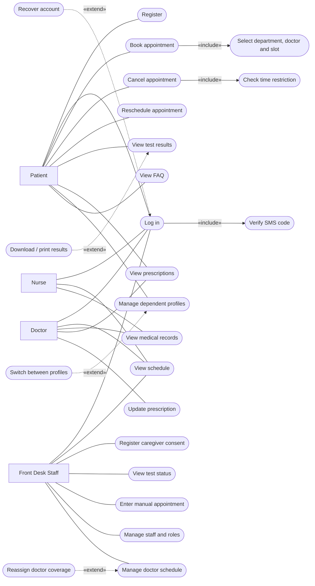

# Use Cases

This document reproduces the project's UML use-case model and maps every use case to the code that implements it.

The diagram below is the Mermaid reproduction of the use-case diagram from the SRS. Mermaid has no dedicated use-case notation, so ellipses are drawn as rounded nodes, actors as rectangles, `«include»` as solid arrows and `«extend»` as dashed arrows.

---

## Use-case diagram

---

## Use case → code map

Every row below was verified against the source. "Function" refers to an action exposed by [`src/context/AppContext.jsx`](../src/context/AppContext.jsx) unless the file column says otherwise.

| ID | Use case | Actor(s) | Route | File | Function |
| --- | --- | --- | --- | --- | --- |
| UC-01 | Register | Patient | `/kayit` | `pages/Kayit.jsx` | `kayitOl()` |
| UC-02 | Log in — `«include»` Verify SMS code | All roles | `/giris` | `pages/Giris.jsx` | `girisYap()` |
| — | Recover account — `«extend»` of Log in | All roles | `/hesap-kurtar` | `pages/HesapKurtar.jsx` | local validation only |
| UC-03 | Book appointment — `«include»` Select department / doctor / slot | Patient | `/hasta/randevu-al` | `pages/hasta/RandevuAl.jsx` | `randevuAl()` |
| UC-04 | Cancel appointment — `«include»` Check time restriction | Patient | `/hasta/randevularim` | `pages/hasta/Randevularim.jsx` | `randevuIptal()` |
| UC-05 | Reschedule appointment | Patient | `/hasta/randevularim` | `pages/hasta/Randevularim.jsx` | `randevuYenidenZamanla()` |
| UC-06 | View schedule | Doctor, Nurse, Front Desk | `/doktor/program`, `/hemsire/program`, `/on-buro/randevular` | `pages/doktor/DoktorProgram.jsx`, `pages/hemsire/HemsireProgram.jsx`, `pages/onBuro/OnBuroRandevular.jsx` | reads `randevular`, `doktorProgramlari` |
| UC-07 | View medical records | Doctor, Nurse | `/doktor/hasta-kayitlari`, `/hemsire/hasta-kayitlari` | `pages/doktor/HastaKayitlari.jsx`, `pages/hemsire/HemsireHastaKayitlari.jsx` | `denetimEkle()` |
| UC-08 | View test results — `«extend»` Download / print | Patient | `/hasta/test-sonuclari` | `pages/hasta/TestSonuclari.jsx` | local `download()` / `print()` |
| UC-09 | View prescriptions | Patient, Doctor | `/hasta/recetelerim`, `/doktor/recete-yonetimi` | `pages/hasta/Recetelerim.jsx`, `pages/doktor/ReceteYonetimi.jsx` | local `print()` |
| UC-10 | Update prescription | Doctor | `/doktor/recete-yonetimi` | `pages/doktor/ReceteYonetimi.jsx` | `receteGuncelle()` |
| UC-11 | Manage dependent profiles — `«extend»` Switch between profiles | Patient | `/hasta/bagimli-profiller` | `pages/hasta/BagimliProfiller.jsx` | `bagimliProfilEkle()`, `setAktifProfil()` |
| UC-12 | Register caregiver consent | Front Desk | `/on-buro/bakim-veren` | `pages/onBuro/BakimVeren.jsx` | `bakimVerenOnasiEkle()` |
| UC-13 | View FAQ | Patient (public) | `/sss` | `pages/SSS.jsx` | reads `sssIcerigi` |
| UC-14 | View test status (restricted projection) | Front Desk | `/on-buro/test-durumu` | `pages/onBuro/TestDurumu.jsx` | `denetimEkle()` |
| UC-15 | Enter manual appointment | Front Desk | `/on-buro/manuel-randevu` | `pages/onBuro/ManuelRandevu.jsx` | `manuelRandevuEkle()` |
| UC-16 | Manage staff and roles | Front Desk | `/on-buro/personel-yonetimi` | `pages/onBuro/PersonelYonetimi.jsx` | `personelRoluGuncelle()` |
| UC-17 | Manage doctor schedule | Front Desk | `/on-buro/doktor-program` | `pages/onBuro/DoktorProgramYonetimi.jsx` | `doktorProgramiGuncelle()` |
| UC-18 | Reassign doctor coverage — `«extend»` of Manage doctor schedule | Front Desk | `/on-buro/doktor-program` | `pages/onBuro/DoktorProgramYonetimi.jsx` | `doktorDevirAta()` |

Two further capabilities exist in the prototype that are not separate use cases in the model:

| Capability | Actor(s) | Route | File | Function |
| --- | --- | --- | --- | --- |
| Edit own profile | All signed-in roles | `/profil` | `pages/Profil.jsx` | `profilGuncelle()` |
| Sign out (manual or 15-min timeout) | All signed-in roles | — | `components/Navbar.jsx`, `context/AppContext.jsx` | `oturumuKapat()` |

---

## How the `«include»` relationships behave in code

### `«include» Verify SMS code` (UC-02)

[`pages/Giris.jsx`](../src/pages/Giris.jsx) is a two-step form. Step 1 collects the 11-digit National ID and a role; step 2 asks for a six-digit code. The code is a constant held in component state and shown on screen — it is never sent anywhere. Only after the code matches is `girisYap(tc, rol)` called, which looks the user up in `personelListesi` by National ID **and** role, sets `aktifKullanici`, clears any active dependent profile, and appends a `Login` entry to the audit log.

### `«include» Select department, doctor and slot` (UC-03)

The wizard in [`pages/hasta/RandevuAl.jsx`](../src/pages/hasta/RandevuAl.jsx) enforces the order: a doctor cannot be chosen before a department, and a slot cannot be chosen before a date. Availability is derived, not stored — the doctor's published slots for the chosen date minus the times already taken by appointments whose status is not `iptalEdildi`.

### `«include» Check time restriction` (UC-04)

`randevuIptal()` parses `\`${randevu.tarih}T${randevu.saat}\`` into a `Date`, computes the difference from now in hours, and returns `{ basarili: false, mesaj: … }` when that difference is below 1. The calling page shows the message and leaves the appointment untouched.

---

## How the `«extend»` relationships behave in code

| Extension | Trigger | Effect |
| --- | --- | --- |
| **Recover account** | User cannot sign in and opens `/hesap-kurtar` | Validates National ID against the registered phone number, then asks for a separate demo code before letting the user continue |
| **Download / print results** | Buttons on a released test result | `download()` builds a text summary and saves it through a blob URL; `print()` opens a formatted window and calls `window.print()` |
| **Switch between profiles** | Patient selects a dependent | `setAktifProfil()` changes `aktifHastaId`, so every patient page re-reads its data for the dependent |
| **Reassign doctor coverage** | Front desk marks a doctor unavailable and picks a replacement | `doktorDevirAta()` moves all `onaylandi` appointments to the new doctor and stamps each with a `devirNotu` |

---

## Audit coverage

The audit log (`denetimKayitlari`) is written for these use cases. Each entry stores `id`, `kullaniciId`, `zaman` (ISO timestamp), `islem` (action) and `detay` (description).

| Use case | Audit action recorded |
| --- | --- |
| UC-02 Log in | `Login` |
| UC-03 Book appointment | `Appointment booked` |
| UC-04 Cancel appointment | `Appointment cancelled` |
| UC-05 Reschedule appointment | `Appointment rescheduled` |
| UC-07 View medical records | record-access entry |
| UC-10 Update prescription | `Prescription updated` |
| UC-12 Register caregiver consent | `Caregiver consent recorded` |
| UC-14 View test status | test-status query entry |
| UC-15 Enter manual appointment | `Manual appointment` |
| UC-16 Manage staff and roles | `Role changed` |
| UC-17 Manage doctor schedule | `Schedule updated` |
| UC-18 Reassign doctor coverage | `Coverage transfer` |

Not audited: registration (no session exists yet), account recovery, FAQ reads, profile edits, dependent-profile creation and profile switching.
